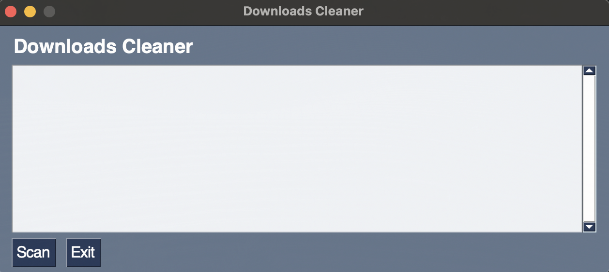
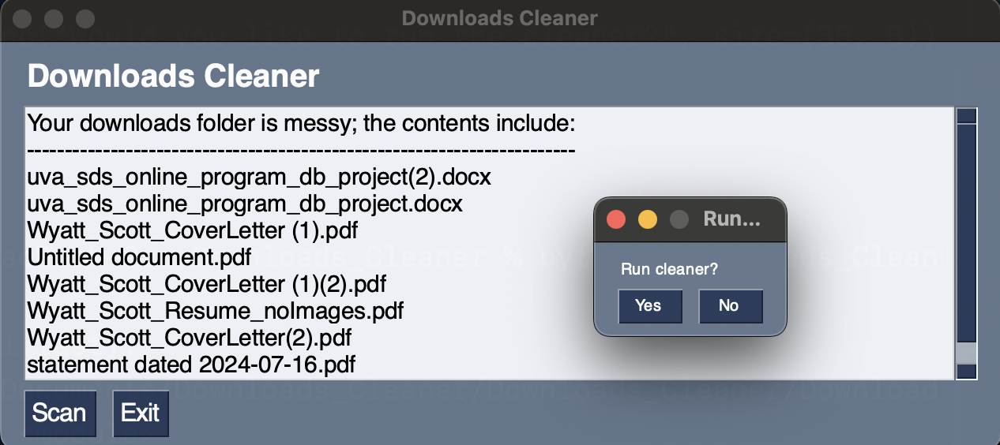
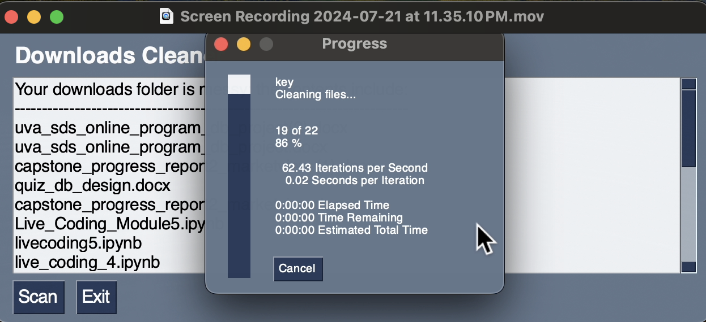
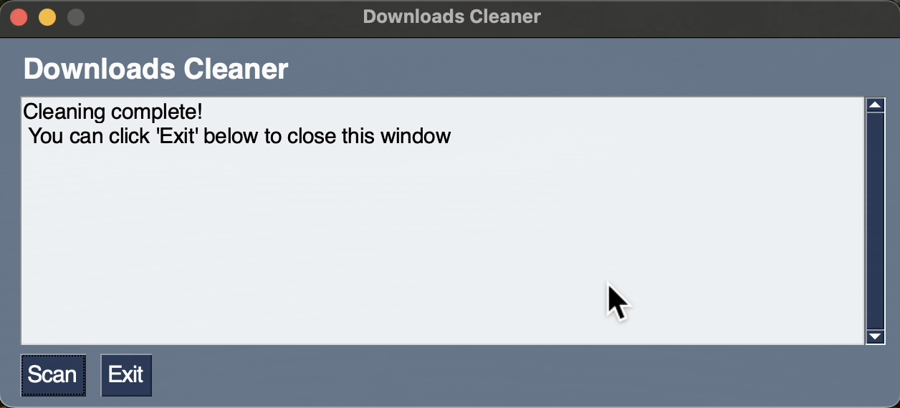

[](https://github.com/WD-Scott/Downloads_Cleaner/actions/workflows/validations.yml)

<div align="center">
    
</div>
<p align="center">

<details>
<summary><h1 style="font-size: 22px;">Issues to Address</h1></summary>

* Build fails if user doesn't have Xcode on their Mac.

* MacOS blocks the application from running, reports "termination reason: namespace SIGNAL, code 6 abort trap: 6"
</details>

<details>
<summary><h1 style="font-size: 22px;">Next steps for building out test suite</h1></summary>

* Add a few versions of Python to run the workflow on (in `validations.yml`).

* Use Prof. Olivares' approach to creating a workflow that tests the package install and uses basic tests.

* Adjust `README.md` file accordingly.

</details>

# Downloads_Cleaner
Personal project to practice Python skills while building something useful — a semi-automated way to clean the Downloads directory!

<details>
<summary><h2 style="font-size: 22px;">Synopsis</h2></summary>


How often have you downloaded documents, pictures, code files, etc., and found yourself scrolling through a vast and unorganized Downloads folder to try and find something you want or need?

I created the `Downloads_Cleaner` as a means of organizing the Downloads directory on MacOS. It's not yet OS-agnostic. I created a few Python module files with functions that I first utilized via a makefile, but this small personal project quickly grew as others asked if they could also use it. Thus, I readjusted the code base and used `PySimpleGui` and `PyInstaller` to create a basic graphical user interface -- effectively turning the Python code base into an executable application.

Upon double-clicking the application, you're presented with the following GUI:

<div align="center">
    
</div>
<p align="center">

You can select to `Scan` to scan the Downloads directory for any new files and create subfolders for documents, images, videos, audio, and code files (based on the file extensions). You can also select `Exit` to close the application.

Upon selecting `Scan`, you'll see text generated in the window that either lets you know that there were no new files in your Downloads folder or, if there were, you'd see a message that "Your downloads folder is messy; the contents include:" followed by the new files in your Downloads directory. At this point, you'll also be presented with a popup to run the cleaner should you choose to do so.

<div align="center">
    
</div>
<p align="center">

If you select "No," the popup closes, and you can select "Exit" to close the application or "Scan" to re-run the scanner.

If you select "Yes," a progress bar will appear, and you'll see a message letting you know that the cleaning is complete.

<div align="center">
    
</div>
<p align="center">

<div align="center">
    
</div>
<p align="center">

There's much room for improvement and additional functionality, as I'm not a software engineer by training.

Rather than make an App installable from the app store, I built this mainly to practice various workflows, from developing a code base and makefile to working in GitHub Actions, etc. So, perhaps eventually, there will be an installable App, but for now, users will have to build it locally (steps outlined below).

</details>

<details>
<summary><h2 style="font-size: 22px;">How to build it on your machine (MacOS-only, for now)</h2></summary>

To get started, clone this repository on your local machine.

```
git clone https://github.com/WD-Scott/Downloads_Cleaner.git
```

Close and re-open your terminal and move into the repository directory

```
cd <wherever you cloned the repo>
```

Now, simply run:

```
make build_exe
```

The executable file will be located in a new folder called `dist`. You can move this to the toolbar or double-click it to launch the GUI and organize your Downloads folder.

</details>

<details>
<summary><h2 style="font-size: 22px;">Manifest</h2></summary>

<details>
<summary><h3 style="font-size: 18px;">.py</h3></summary>
    
- [scanners.py](https://github.com/WD-Scott/Downloads_Cleaner/blob/main/scanners.py)
  
- [cleaner.py](https://github.com/WD-Scott/Downloads_Cleaner/blob/main/cleaner.py)
  
- [Downloads_Cleaner.py](https://github.com/WD-Scott/Downloads_Cleaner/blob/main/Downloads_Cleaner.py)

</details>

<details>
<summary><h3 style="font-size: 18px;">Misc</h3></summary>
    
- [README.md](https://github.com/WD-Scott/Downloads_Cleaner/blob/main/README.md)

- [LICENSE](https://github.com/WD-Scott/Downloads_Cleaner/blob/main/LICENSE)

- [makefile](https://github.com/WD-Scott/Downloads_Cleaner/blob/main/makefile)

- [requirements.txt](https://github.com/WD-Scott/Downloads_Cleaner/blob/main/requirements.txt)

</details>
</details>
